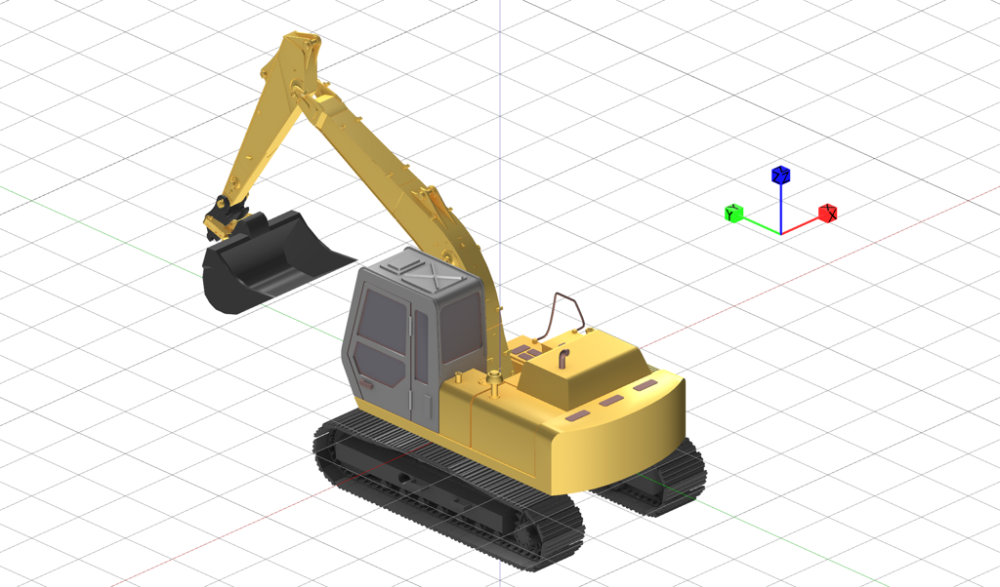

# Novatron Xsite3D Interface


## Package Overview

This package enables ROS2 systems to communicate with Novatron Xsite 3D machine guidance systems. The Xsite 3D system provides precise position and orientation data from machine kinematics. This interface receives kinematic data through MQTT communication and publishes it as standard ROS2 TF transforms.

## Installation

### Dependencies
- ROS2 Jazzy
- Python 3
- `paho-mqtt` - MQTT client library
- `geometry_msgs` - ROS2 geometry messages
- `tf2_ros` - ROS2 TF2 library

### Building

```bash
cd ~/ros2_ws
colcon build --packages-select novatron_xsite3d_interface
source install/setup.bash
```

## Nodes

### kinematic_results_publisher_node

Subscribes to MQTT topics from the Novatron Xsite 3D system to receive real-time kinematic data and publishes TF transforms for world offset and kinematic results.

#### Usage

```bash
ros2 run novatron_xsite3d_interface kinematic_results_publisher_node
```

Or with custom parameters:

```bash
ros2 run novatron_xsite3d_interface kinematic_results_publisher_node \
  --ros-args \
  -p mqtt_host:=192.168.1.100 \
  -p mqtt_port:=8884 \
  -p mqtt_username:=user \
  -p mqtt_password:=password \
  -p mqtt_topic:=novatron/realtime-app/kinematicResults
```

#### Parameters

| Parameter | Type | Default | Description |
|-----------|------|---------|-------------|
| `mqtt_host` | string | `192.168.4.232` | IP address or hostname of the MQTT broker connected to Xsite 3D system |
| `mqtt_port` | int | `8884` | Port number of the MQTT broker |
| `mqtt_username` | string | `user` | Username for MQTT broker |
| `mqtt_password` | string | `password` | Password for the MQTT broker |
| `mqtt_topic` | string | `novatron/realtime-app/kinematicResults` | MQTT topic to subscribe to for kinematic results |

#### Published Topics

This node publishes TF transforms (via `tf2_ros.TransformBroadcaster`):

| Transform | Parent Frame | Child Frame | Description |
|-----------|--------------|-------------|-------------|
| World Offset | `world` | `world_offset` | Base transform representing the world offset from Xsite 3D system. `world` coordinate is the same as the coordinate system used for the project/worksite. This means that if you use different coordinate system for the loaded project the position of the coordinates change. `world_offset` is the local coordinate system used for visualization in Xsite 3D. |
| Kinematic Results | `world_offset` | `kinematic_{id}` | Individual kinematic result transforms for each tracked entity (where `{id}` is the unique identifier from Xsite 3D) |

**Note:** The node dynamically publishes transforms for all kinematic results received from the MQTT stream. The number of `kinematic_{id}` frames depends on the configuration of the Xsite 3D system.

## Coordinate Systems

### Frame Relationships

The TF tree published by this package follows this hierarchy:

```
world
└── world_offset
    ├── kinematic_0
    ├── kinematic_1
    └── kinematic_N
```

### Coordinate Frame Definitions for Excavator

Novatron Xsite 3D machine control system uses use ENU coordinate convention Axes conventions where X = East, Y = North, Z = up. 



The id of each kinematic_id is given in world_offset_coordinate_system

| ID | Description |
|-----------|--------------|
| 1000 | Center point of rotation axis of excavator with yaw included |
| 1005 | Center point of rotation axis of excavator with yaw, pitch and roll included|
| 1003 | Boom joint |
| 1002 | Arm joint |
| 1001 | Bucket joint |
| 2001 | Quick coupler |
| 2002 | Tilt rotator base |
| 2003 | Tilt joint |
| 2004 | Rotator joint |
| 3001 | Bucket blade left |
| 3002 | Bucket blade center |
| 3003 | Bucket blade right |
| 3005 | Bucket bottom flat center |
## Message Format

The package uses FlatBuffer schemas to deserialize MQTT messages from Xsite 3D. The schemas are located in `novatron_xsite3d_interface/fb/` and define the structure of kinematic data including:
- Position (Vector3d)
- Orientation (Quaternion)
- Kinematic quality values
- Multiple kinematic results per message

## Troubleshooting

### Connection Issues
- Verify MQTT broker is accessible from your network
- Check firewall settings and port accessibility
- Use `mosquitto_sub` to test MQTT connectivity independently

### No TF Frames Published
- Verify Xsite 3D system is running and publishing data
- Verify that you can see the machine moving in Xsite 3D system
- Check MQTT topic name matches the Xsite 3D configuration
- Use `ros2 run tf2_ros tf2_echo world world_offset` to verify transform publication

## Maintainer

Antti Kolu (antti.kolu@novatron.fi)

## License

TODO: License declaration
